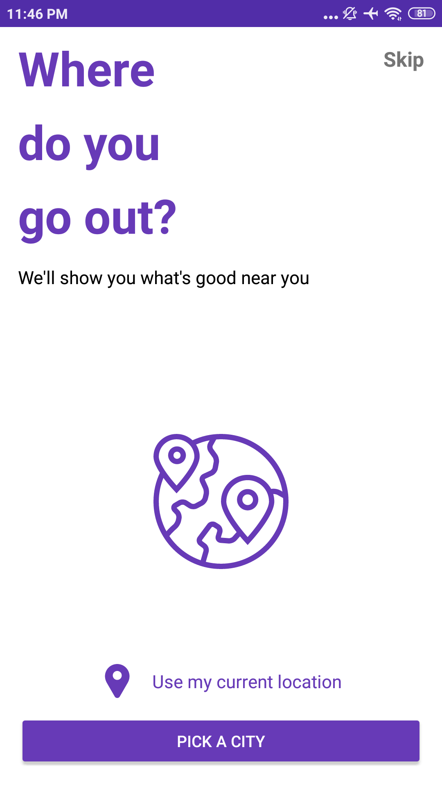
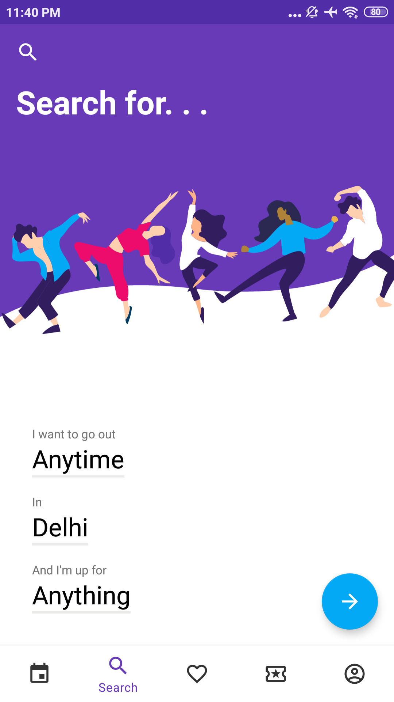
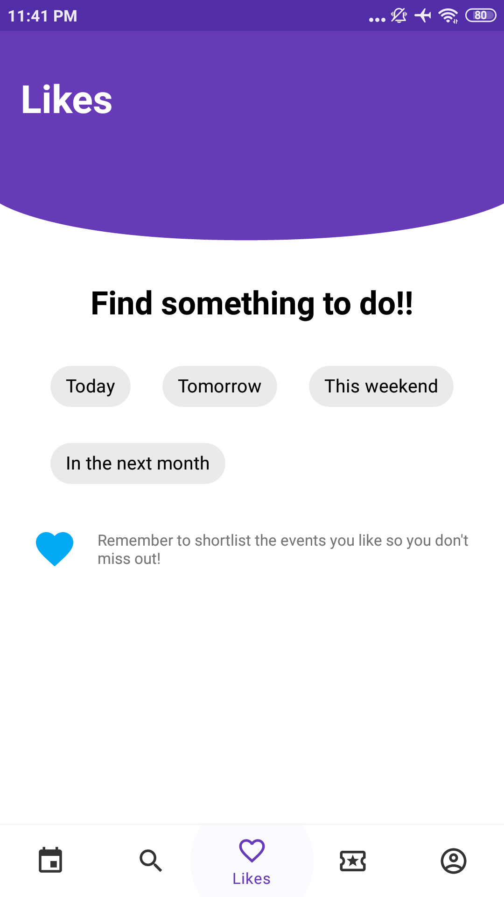
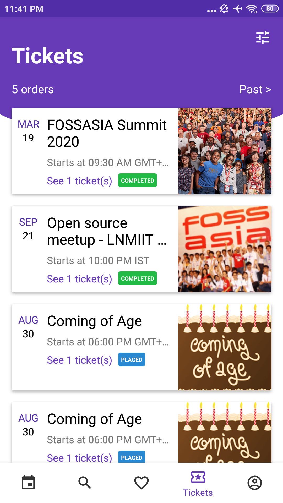
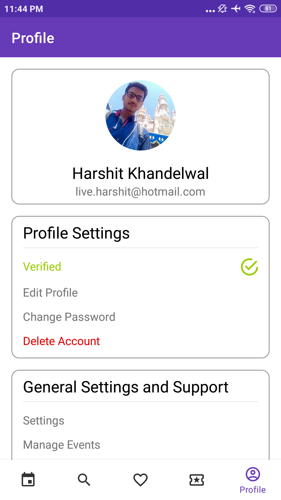
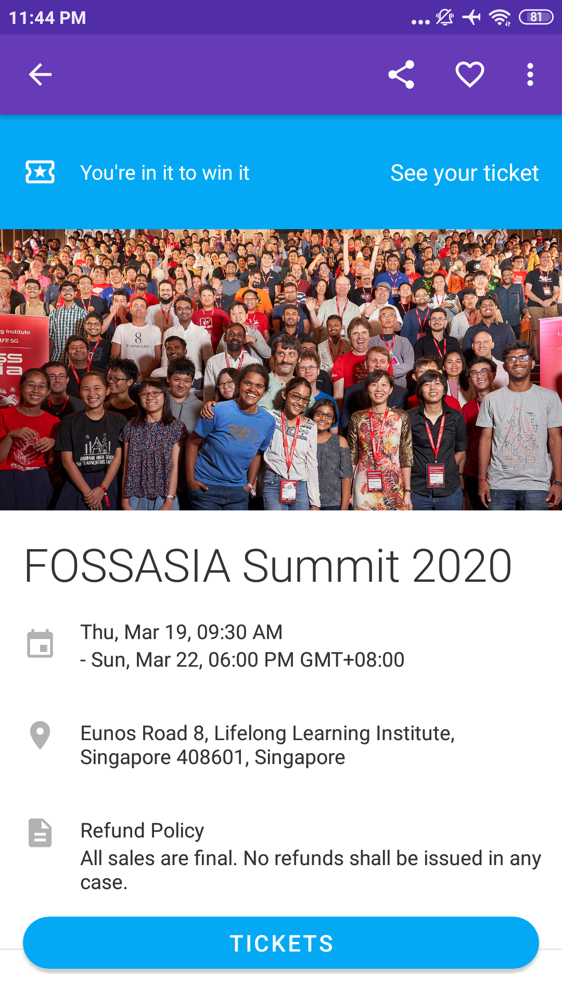
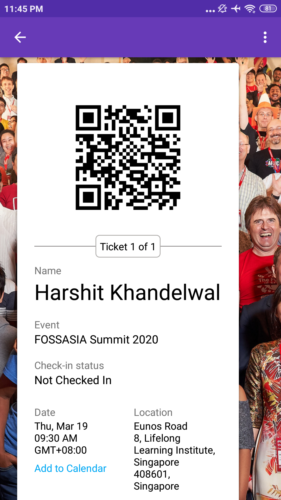
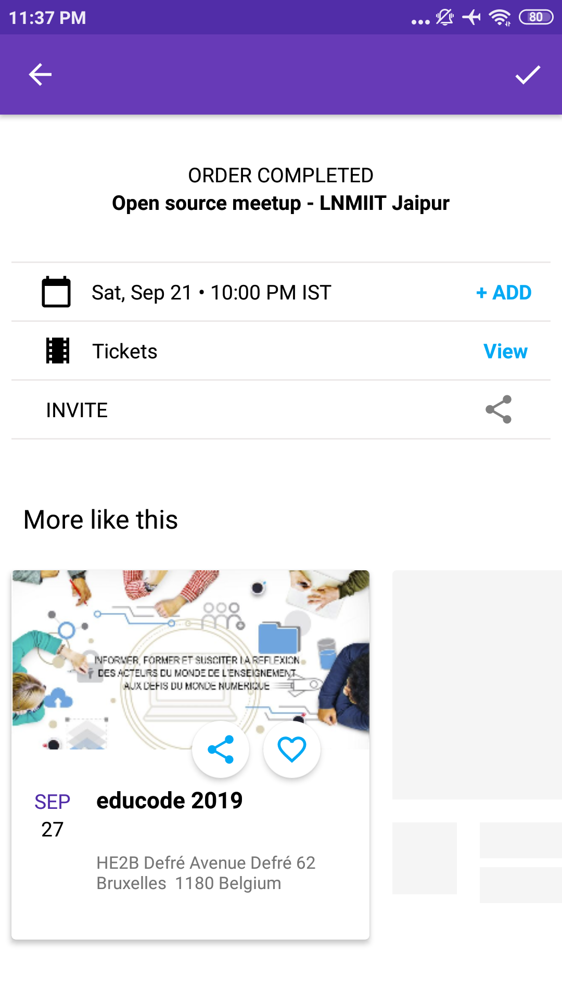

# Open Event Attendee App

An events app to discover events happening around the world using the Open Event Platform on Eventyay.com.

Application is available here:

## Roadmap

Planned features & enhancements are:

## Communication

Please join our mailing list to discuss questions regarding the project: https://groups.google.com/forum/#!forum/open-event

Our chat channel is on gitter [here](https://gitter.im/fossasia/open-event-attendee-android)

## Screenshots
<table>
        <tr>
<td></td>
<td></td>
<td></td>
        </tr>
        <tr>
<td></td>
<td></td>
<td></td>
        </tr>
        <tr>
<td></td>
<td></td>
<td></td>
        </tr>
</table>        

## Development

A native Android app using Kotlin for writing code.

### Libraries used and their documentation

- Retrofit [Docs](http://square.github.io/retrofit/2.x/retrofit/)
- Espresso [Docs](https://github.com/codepath/android_guides/wiki/UI-Testing-with-Espresso)
- Picasso [Docs](http://square.github.io/picasso/)
- Timber [Docs](http://jakewharton.github.io/timber/)
- RxAndroid [Docs](https://github.com/ReactiveX/RxAndroid)
- Stripe [Docs](https://github.com/stripe/stripe-android)
- InsertKoinIO [Docs](https://github.com/InsertKoinIO/koin)
- JSON API Converter [Docs](https://github.com/jasminb/jsonapi-converter)
- OkHttp [Docs](http://square.github.io/okhttp/)
- Room Persistence Library [Docs](https://developer.android.com/topic/libraries/architecture/room)

### Project Conventions

There are certain conventions we follow in the project, we recommend that you become familiar with these so that the development process is uniform for everyone:

#### Project Structure

Generally, projects are created using package by layer approach where packages are names by layers like `ui`, `activity`, `fragment`, etc but it quickly becomes unscalable in large projects where a large number of unrelated classes are crammed in one layer and it becomes difficult to navigate through them.  
Instead, we follow package by feature, which at the cost of flatness of our project, provides us packages of isolated functioning related classes which are likely to be a complete self-sufficient component of the application. Each package contains all related classes of view, presenter, their implementations like Activities and Fragments.  
A notable exception to this is the `helper` module and data classes like Models and Repositories as they are used in a cross component way.  

#### Separation of concerns

Lastly, each class should only perform one task, do it well, and be unit tested for it. For example, if a presenter is doing more than it should, i.e., parsing dates or implementing search logic, better move it in its own class. There can be exceptions to this practice, but if the functionality can be generalised and reused, it should most definitely be transferred in its own class and unit tested.

## Contributions Best Practices

### For first time Contributors

First time contributors can read [CONTRIBUTING.md](/CONTRIBUTING.md) file for help regarding creating issues and sending pull requests.

### Branch Policy

We have the following branches

 * **development** All development goes on in this branch. If you're making a contribution, you are supposed to make a pull request to _development_. PRs to development branch must pass a build check and a unit-test check on Circle CI.
 * **master** This contains shipped code. After significant features/bugfixes are accumulated on development, we make a version update and make a release.
 	- Please Note that :-
		> Each push to master branch automatically publishes the application to Play Store as an Alpha Release. Thus, on each merge into master, the versionCode and versionName MUST be changed accordingly in app/build.gradle

	 - _versionCode_ : **Integer** : To be monotonically incremented with each merge. Failure to do so will lead to 				publishing error, and thus is a crucial step before any merge
	 - _versionName_ : **String** : User visible version of the app. To be changed following [semantic versioning](http://semver.org/)
 * **apk** This branch contains two apk's, that are automatically generated on the merged pull request a) debug apk and b) release apk.
    - Please download and test the app that is using the code from the development and master branches [here](https://github.com/fossasia/open-event-attendee-android/tree/apk).
### Code practices

Please help us follow the best practices to make it easy for the reviewer as well as the contributor. We want to focus on the code quality more than on managing pull request ethics.

 * Single commit per pull request
 * For writing commit messages please read the COMMITSTYLE carefully. Kindly adhere to the guidelines.
 * Follow uniform design practices. The design language must be consistent throughout the app.
 * The pull request will not get merged until and unless the commits are squashed. In case there are multiple commits on the PR, the commit author needs to squash them and not the maintainers cherrypicking and merging squashes.
 * If the PR is related to any front end change, please attach relevant screenshots in the pull request description.

### Join the development

* Before you join development, please set up the project on your local machine, run it and go through the application completely. Press on any button you can find and see where it leads to. Explore. (Don't worry ... Nothing will happen to the app or to you due to the exploring :wink: Only thing that will happen is, you'll be more familiar with what is where and might even get some cool ideas on how to improve various aspects of the app.)
* If you would like to work on an issue, drop in a comment at the issue. If it is already assigned to someone, but there is no sign of any work being done, please free to drop in a comment so that the issue can be assigned to you if the previous assignee has dropped it entirely.

## For Testers: Testing the App
If you are a tester and want to test the app, you have two ways to do that:
1. **Installing APK on your device:** You can get debug APK as well as Release APK in apk branch of the repository. After each PR merge, both the APKs are automatically updated. So, just download the APK you want and install it on your device. The APKs will always be the latest one.

## Open Event Attendee Android Suggestions

- Suggestion form link: [Form](https://docs.google.com/forms/d/e/1FAIpQLSd7Y1T1xoXeYaAG_b6Tu1YYK-jZssoC5ltmQbkUX0kmDZaKYw/viewform)
- Suggestion responses link: [Sheet](https://docs.google.com/spreadsheets/d/1SzR75MBEVrTY1sDM3KAMm9wltiulDAp0QT5hv9eJkKM/edit#gid=1676755229)

## License

This project is currently licensed under the Apache License Version 2.0. A copy of [LICENSE](LICENSE) should be present along with the source code. To obtain the software under a different license, please contact FOSSASIA.
